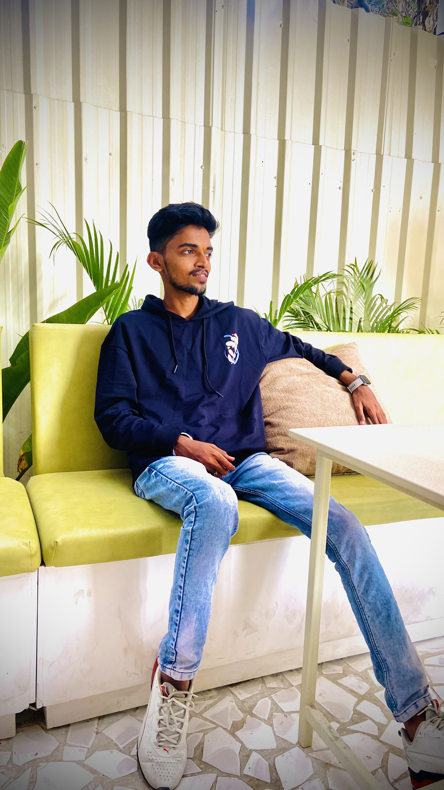

# 🚀 Portfolio Website - Rumanshu Chandekar

## 📋 Project Overview

This portfolio website serves as a professional showcase for Rumanshu Chandekar, a Machine Learning Engineer with expertise in developing and deploying end-to-end ML solutions. The website is designed to highlight skills, experience, projects, and provide a means for potential employers or clients to make contact.

**Target Audience:**
- Potential employers in the tech industry
- Clients seeking ML engineering expertise
- Fellow professionals in the data science and ML community
- Recruiters and hiring managers

The website features a modern, responsive design with interactive elements, smooth animations, and a clean, professional aesthetic that reflects the technical nature of the work showcased.

## 🛠️ Technologies Used

The portfolio website leverages the following technologies:

- **Frontend Framework:**
  - Next.js 14.0.4 (App Router)
  - React 18.2.0

- **Styling:**
  - Tailwind CSS 3.3.0
  - CSS Modules
  - CSS Variables for theming

- **Animation & Interactivity:**
  - Framer Motion 10.16.4
  - Custom CSS animations

- **UI Components:**
  - Shadcn/UI (custom component library)
  - Lucide React 0.294.0 (icon library)

- **Development Tools:**
  - TypeScript 5.3.3
  - ESLint 8.55.0
  - Prettier 3.1.1

- **Deployment:**
  - Vercel Platform
  - Vercel Analytics

- **Version Control:**
  - Git
  - GitHub

## 🔄 Development Process

### 📐 Planning

The development process began with a clear vision for a professional portfolio that would effectively showcase ML engineering skills and projects.

1. **Inspiration & Research:**
   - Analyzed the design and functionality of mitchellsparrow.com
   - Researched current trends in developer portfolios
   - Identified key sections needed: Home, About, Experience, Skills, Projects, Contact

2. **Design Decisions:**
   - Opted for a minimalist design with a focus on content
   - Chose a teal primary color scheme for a professional yet distinctive look
   - Planned for both light and dark mode
   - Designed for full responsiveness across all device sizes

3. **Feature Planning:**
   - Snap scrolling navigation for intuitive section browsing
   - Interactive skill cards with proficiency indicators
   - Animated background elements
   - Typewriter effect for the hero section
   - Horizontal scrolling for projects and experience cards

### ⚙️ Setup

The project setup involved creating a Next.js application with the App Router and configuring it with necessary dependencies:

\`\`\`bash
# Create a new Next.js project with TypeScript
npx create-next-app@latest portfolio-website --typescript --eslint --app --tailwind

# Navigate to the project directory
cd portfolio-website

# Install additional dependencies
npm install framer-motion lucide-react
npm install -D tailwindcss postcss autoprefixer
npx tailwindcss init -p
\`\`\`

### 🏗️ Implementation

#### 1. Project Structure

The project follows the Next.js App Router structure:

\`\`\`
portfolio-website/
├── app/
│   ├── globals.css
│   ├── layout.tsx
│   └── page.tsx
├── components/
│   ├── background-circles.tsx
│   ├── experience-card.tsx
│   ├── project-card.tsx
│   ├── skill.tsx
│   ├── theme-provider.tsx
│   ├── theme-toggle.tsx
│   └── ui/
│       └── [shadcn components]
├── public/
│   └── images/
├── lib/
│   └── utils.ts
└── [configuration files]
\`\`\`

#### 2. Home Section

The home section features:
- A hero component with animated background circles
- Profile image
- Typewriter animation for the name
- Navigation buttons to other sections
- Social media links
- Theme toggle

\`\`\`tsx
// Typewriter Animation Implementation
<h1 className="text-xl md:text-4xl lg:text-6xl font-semibold px-5 md:px-10">
  Hi, I'm Rumanshu
</h1>
\`\`\`

#### 3. About Section

The about section includes:
- A profile image
- A brief professional summary
- Motion animations for entrance effects

#### 4. Experience Section

The experience section features:
- Horizontally scrollable experience cards
- Company logo, title, and date information
- Bullet points highlighting key achievements
- Technology icons used in each role

\`\`\`tsx
// Experience Card Component
<article className="flex drop-shadow-xl flex-col rounded-3xl items-center space-y-0 flex-shrink-0 w-[280px] sm:w-[350px] md:w-[600px] xl:w-[700px] snap-center bg-card bg-gradient-to-tr from-card to-primary/5 p-4 md:p-6 hover:opacity-100 opacity-100 cursor-pointer transition-opacity duration-200 h-full overflow-hidden">
  {/* Card content */}
</article>
\`\`\`

#### 5. Skills Section

The skills section showcases:
- A grid of skill icons with proficiency percentages
- Hover effects to reveal proficiency levels
- Directional animations for entrance effects

#### 6. Projects Section

The projects section includes:
- Horizontally scrollable project cards
- Project images with title overlays
- Project summaries and technology tags
- Visual enhancements for readability

\`\`\`tsx
// Project Card Image and Title Implementation

  
  

    <h3 className="text-white text-lg md:text-2xl font-bold p-4 w-full drop-shadow-lg">{title}</h3>
  

\`\`\`

#### 7. Contact Section

The contact section provides:
- A contact form with name, email, subject, and message fields
- Email and GitHub contact information
- Visual styling consistent with the site theme

#### 8. Education Section

The education section displays:
- Academic qualifications
- Institution information
- Graduation dates and achievements

### 🎨 Styling

The styling approach leverages Tailwind CSS with custom configurations:

1. **Theme Configuration:**
   - Custom color palette defined in `tailwind.config.ts`
   - CSS variables for theme colors in `globals.css`
   - Dark/light mode support

2. **Responsive Design:**
   - Mobile-first approach with responsive breakpoints
   - Tailwind's responsive modifiers (sm, md, lg, xl)
   - Custom media queries for specific components

3. **Custom Components:**
   - Reusable button styles with the `heroButton` class
   - Form input styling with the `contactInput` class
   - Custom scrollbar styling

4. **Animations:**
   - Framer Motion for entrance animations and transitions
   - Custom keyframe animations for typewriter effect
   - Hover state animations for interactive elements

\`\`\`css
/* Typewriter Animation CSS */
@keyframes typing {
  from { width: 0 }
  to { width: 100% }
}

@keyframes blink-caret {
  from, to { border-color: transparent }
  50% { border-color: hsl(var(--primary)) }
}

.typewriter {
  overflow: hidden;
  display: inline-block;
  white-space: nowrap;
  border-right: 0.15em solid hsl(var(--primary));
  animation: typing 3.5s steps(30, end), blink-caret 0.75s step-end infinite;
}
\`\`\`

### 🚢 Deployment

The website was deployed using Vercel's platform:

1. **Preparation:**
   - Optimized images for web
   - Ensured all environment variables were properly set
   - Ran final build tests locally

2. **Deployment Steps:**
   - Connected GitHub repository to Vercel
   - Configured build settings
   - Deployed to production

3. **Post-Deployment:**
   - Verified site functionality across devices
   - Set up analytics
   - Configured custom domain (optional)

## 💬 Prompt Engineering Techniques

The development of this portfolio website leveraged AI-assisted coding through strategic prompt engineering:

### 📝 Prompt Examples

**Initial Structure Prompt:**
\`\`\`
Create a modern portfolio website inspired by mitchellsparrow.com but customized for my resume data as a Machine Learning Engineer. The site should have sections for Home, About, Experience, Skills, Projects, and Contact. Use Next.js with the App Router and Tailwind CSS.
\`\`\`

**Refinement Prompt:**
\`\`\`
Update the portfolio website to include my profile picture in the home section, add an about photo, add a photo in the experience section, improve the skills section with custom icons, enhance the project section, and update the contact section.
\`\`\`

**Component-Specific Prompt:**
\`\`\`
Implement a typewriter animation for the "Hi, I'm Rumanshu" text in the hero section using CSS animations.
\`\`\`

### 🔍 Techniques

1. **Specificity:**
   - Provided exact requirements for each section
   - Specified exact technologies to use
   - Referenced specific design inspirations

2. **Iteration:**
   - Started with a basic structure
   - Incrementally improved specific components
   - Refined styling and animations in subsequent prompts

3. **Constraints:**
   - Set clear boundaries for design aesthetics
   - Specified mobile-first and responsive requirements
   - Defined performance expectations

4. **Visual References:**
   - Provided images to be integrated
   - Referenced existing designs for inspiration
   - Shared screenshots for specific fixes

### 🧰 Tools

- **Vercel v0**: Used for generating and refining code
- **GitHub Copilot**: Assisted with code completion and suggestions
- **ChatGPT**: Used for brainstorming design ideas and solving specific challenges

## 📁 Code Structure

The project follows a modular component-based architecture:

### Key Files and Directories

- **`app/page.tsx`**: Main page component containing all sections
- **`app/layout.tsx`**: Root layout with theme provider
- **`app/globals.css`**: Global styles and CSS variables
- **`components/`**: Reusable UI components
  - **`background-circles.tsx`**: Animated circles for hero section
  - **`experience-card.tsx`**: Card component for experience items
  - **`project-card.tsx`**: Card component for project items
  - **`skill.tsx`**: Interactive skill component
  - **`theme-provider.tsx`**: Context provider for theme switching
  - **`theme-toggle.tsx`**: Button component for toggling theme
- **`public/images/`**: Static images and icons

### Component Architecture

The website uses a combination of:
- **Page Components**: Large sections like Home, About, etc.
- **UI Components**: Reusable elements like cards and buttons
- **Layout Components**: Structural elements for page organization

## 🧩 Challenges and Solutions

### Challenge 1: Responsive Design for Various Screen Sizes

**Problem**: Ensuring the website looked good and functioned well on devices ranging from mobile phones to large desktop monitors.

**Solution**: 
- Implemented a mobile-first design approach
- Used Tailwind's responsive modifiers extensively
- Created custom breakpoints for specific components
- Tested on multiple device sizes and adjusted accordingly

### Challenge 2: Project Card Title Visibility

**Problem**: Project titles were difficult to read against varying background images.

**Solution**:
- Added a semi-transparent black background with backdrop blur
- Positioned the title at the bottom of the image
- Added drop shadow to the text for additional contrast
- Increased text size for better readability

\`\`\`tsx

  <h3 className="text-white text-lg md:text-2xl font-bold p-4 w-full drop-shadow-lg">{title}</h3>

\`\`\`

### Challenge 3: Implementing the Typewriter Effect

**Problem**: Creating a smooth, realistic typewriter animation for the hero section.

**Solution**:
- Used CSS keyframe animations for typing and cursor blinking
- Implemented proper timing and steps for a realistic effect
- Ensured the animation worked well across browsers

### Challenge 4: Dark/Light Mode Implementation

**Problem**: Creating a seamless theme switching experience with proper color transitions.

**Solution**:
- Used CSS variables for theme colors
- Implemented a context-based theme provider
- Added smooth transitions between themes
- Ensured all components respected the current theme

## 🔮 Future Enhancements

The portfolio website could be enhanced with the following features:

1. **Blog Section**: Add a blog to share technical insights and project details
2. **Project Detail Pages**: Create dedicated pages for each project with more comprehensive information
3. **Interactive Resume**: Add a downloadable and interactive resume viewer
4. **Testimonials**: Include testimonials from colleagues or clients
5. **Animation Improvements**: Add more subtle animations and transitions
6. **Performance Optimization**: Further optimize images and code for faster loading
7. **Internationalization**: Add support for multiple languages
8. **Analytics Dashboard**: Implement a private dashboard to track visitor statistics
9. **Advanced Contact Form**: Enhance the contact form with validation and auto-response
10. **Accessibility Improvements**: Further enhance accessibility features

## 🙏 Acknowledgments

- Design inspiration from Mitchell Sparrow's portfolio website
- Shadcn UI for the component library foundation
- Vercel for hosting and deployment
- The Next.js and React communities for documentation and resources
- Tailwind CSS for the utility-first styling approach
- Framer Motion for the animation capabilities

## 📞 Contact Information

For questions, collaborations, or inquiries about this project, please contact:

- **Email**: chandekarrumanshu@gmail.com
- **GitHub**: [github.com/Rumanshu123](https://github.com/Rumanshu123)
- **LinkedIn**: [linkedin.com/in/rumanshu-chandekar](https://linkedin.com/in/rumanshu-chandekar)

## 🚀 Running the Project Locally

To run this project on your local machine using VS Code:

1. **Clone the repository:**
   \`\`\`bash
   git clone https://github.com/Rumanshu123/portfolio-website.git
   cd portfolio-website
   \`\`\`

2. **Install dependencies:**
   \`\`\`bash
   npm install
   \`\`\`

3. **Run the development server:**
   \`\`\`bash
   npm run dev
   \`\`\`

4. **Open in browser:**
   Navigate to `http://localhost:3000` in your web browser

5. **VS Code Extensions (recommended):**
   - Tailwind CSS IntelliSense
   - ESLint
   - Prettier
   - TypeScript Vue Plugin (Volar)

6. **Building for production:**
   \`\`\`bash
   npm run build
   \`\`\`

7. **Running production build locally:**
   \`\`\`bash
   npm run start
   \`\`\`

---

Built with ❤️ using Next.js and Tailwind CSS
